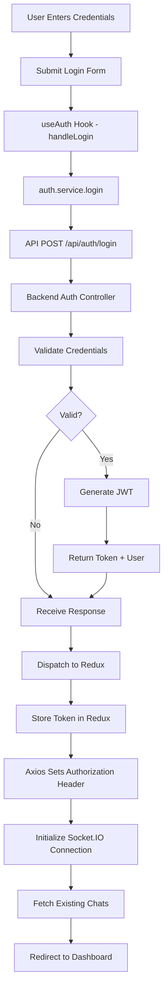
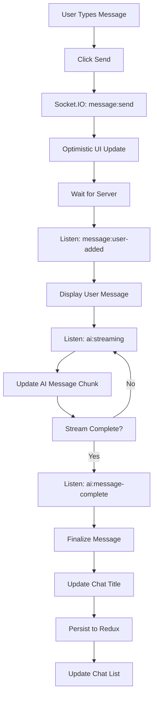
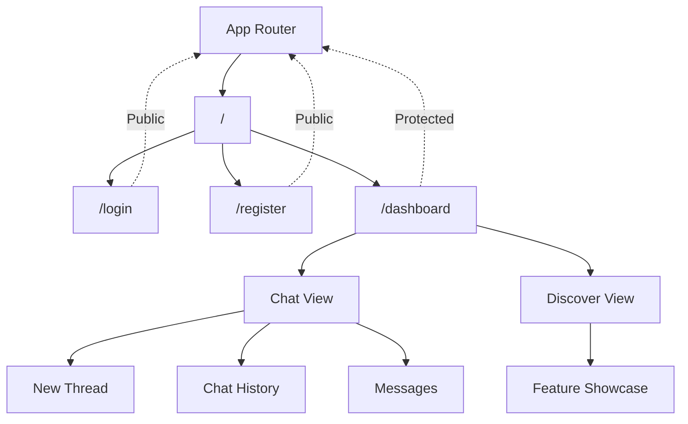
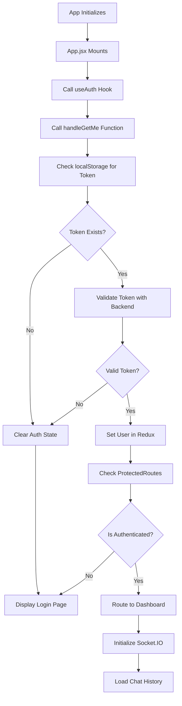
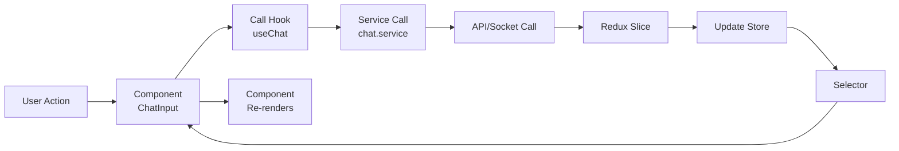
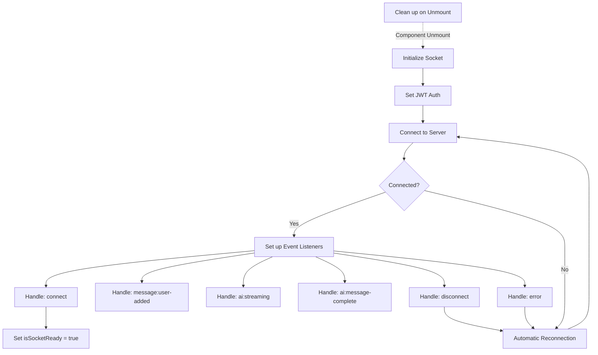

# Perplexity Frontend

React and Vite based frontend application providing a modern, responsive user interface for an AI-powered chat application with real-time messaging, theme switching, and seamless user authentication.

## Overview

The frontend provides:
- User authentication and session management
- Interactive chat interface with real-time messaging
- AI response streaming with visual feedback
- Chat history management
- Dark/Light theme switching
- Mobile-responsive design
- Markdown rendering with syntax highlighting

## Tech Stack

- **Framework**: React 19
- **Build Tool**: Vite
- **State Management**: Redux Toolkit
- **Styling**: Tailwind CSS 4
- **Routing**: React Router DOM v7
- **HTTP Client**: Axios
- **Real-time Communication**: Socket.IO Client
- **Markdown**: React Markdown with GitHub Flavored Markdown
- **Code Highlighting**: Highlight.js
- **Icons**: Lucide React
- **Linting**: ESLint

## Project Structure

```
Frontend/
├── src/
│   ├── main.jsx                        (Entry point)
│   ├── index.html                      (HTML template)
│   │
│   ├── app/
│   │   ├── App.jsx                     (Root component)
│   │   ├── App.routes.jsx              (Route configuration)
│   │   ├── app.store.js                (Redux store setup)
│   │   ├── theme.slice.js              (Theme state)
│   │   └── index.css                   (Global styles)
│   │
│   ├── features/
│   │   ├── API/
│   │   │   └── api.js                  (Axios instance)
│   │   │
│   │   ├── Auth/
│   │   │   ├── auth.slice.js           (Auth state management)
│   │   │   ├── components/
│   │   │   │   └── Input.jsx           (Reusable input)
│   │   │   ├── hooks/
│   │   │   │   └── useAuth.jsx         (Auth logic hook)
│   │   │   ├── pages/
│   │   │   │   ├── Login.jsx           (Login page)
│   │   │   │   └── Register.jsx        (Registration page)
│   │   │   ├── services/
│   │   │   │   └── auth.service.js     (Auth API calls)
│   │   │   └── validator/
│   │   │       └── auth.validator.js   (Input validation)
│   │   │
│   │   ├── Chat/
│   │   │   ├── chat.slice.js           (Chat state management)
│   │   │   ├── components/
│   │   │   │   ├── ChatGreeting.jsx    (Initial greeting)
│   │   │   │   ├── ChatHeader.jsx      (Chat title header)
│   │   │   │   ├── ChatInput.jsx       (Message input)
│   │   │   │   ├── Discover.jsx        (Feature discovery)
│   │   │   │   ├── Message.jsx         (Message item)
│   │   │   │   ├── MessageList.jsx     (Messages container)
│   │   │   │   └── Layout/
│   │   │   │       ├── DashboardLayout.jsx
│   │   │   │       ├── MainContent.jsx
│   │   │   │       └── Sidebar.jsx
│   │   │   ├── hooks/
│   │   │   │   ├── useChat.jsx         (Chat logic)
│   │   │   │   └── useMarkdownRenderer.jsx
│   │   │   ├── pages/
│   │   │   │   └── Dashboard.jsx       (Main chat page)
│   │   │   └── services/
│   │   │       ├── chat.service.js     (Chat API calls)
│   │   │       └── chat.socket.js      (Socket.IO handler)
│   │   │
│   │   └── Theme/
│   │       ├── components/
│   │       │   └── ThemeToggle.jsx     (Theme switcher)
│   │       └── hooks/
│   │           └── useTheme.jsx        (Theme logic)
│   │
│   ├── hooks/
│   │   └── useIsMobile.jsx             (Mobile detection)
│   │
│   └── utils/
│       └── ProtectedRoutes.jsx         (Route protection)
│
├── vite.config.js                       (Vite configuration)
├── eslint.config.js                     (ESLint rules)
├── package.json
├── .env.example
└── README.md
```

## Redux State Structure

```
store/
├── auth
│   ├── user
│   ├── token
│   ├── isAuthenticated
│   └── loading
│
├── chat
│   ├── chats
│   │   └── { [chatId]: { id, title, messages, lastUpdated } }
│   ├── currentChatId
│   ├── messages
│   │   └── { [messageId]: { id, content, role, isStreaming } }
│   ├── viewMode ('chat' | 'discover')
│   ├── loading
│   └── error
│
└── theme
    └── mode ('light' | 'dark')
```

## Core Components

### Authentication Components

#### Login.jsx
- Email and password input
- Login form validation
- Error handling
- Redirect on success

#### Register.jsx
- Username, email, password input
- Password validation
- Account creation
- Auto-login on success

### Chat Components

#### Dashboard.jsx
- Main chat container
- Routes to chat or discover view
- Protected route wrapper

#### ChatHeader.jsx
- Display current chat title
- Mobile menu toggle
- Chat options

#### ChatInput.jsx
- Message text input
- Send button
- Auto-focus on new chat
- Loading state display

#### MessageList.jsx
- Scrollable message container
- Auto-scroll to latest
- Empty state display

#### Message.jsx
- User/AI message rendering
- Markdown rendering
- Code syntax highlighting
- Streaming animation

#### Sidebar.jsx
- Chat history list
- New chat button
- Discover button
- User profile section
- Chat deletion with confirmation
- Mobile collapse/expand

### Layout Components

#### DashboardLayout.jsx
- Overall layout structure
- Sidebar + Main content
- Responsive sidebar toggle
- Mobile-aware rendering

#### MainContent.jsx
- Content wrapper
- Route-based view rendering
- Loading states

## Custom Hooks

### useAuth.jsx
Manages authentication state and operations:
```javascript
const {
  user,
  token,
  isAuthenticated,
  loading,
  handleRegister,
  handleLogin,
  handleLogout,
  handleGetMe
} = useAuth();
```

### useChat.jsx
Manages chat operations:
```javascript
const {
  handleSendMessage,
  handleGetChats,
  handleOpenChat,
  handleDeleteChat,
  isSocketReady
} = useChat();
```

### useTheme.jsx
Manages theme state:
```javascript
const {
  theme,
  toggleTheme
} = useTheme();
```

### useIsMobile.jsx
Detects mobile screen size:
```javascript
const isMobile = useIsMobile();
```

## Data Flow

### User Login Flow



### Chat Message Flow



## Routing Structure



## Authentication Flow



## State Management Pattern



## Socket.IO Integration

### Connection Flow



### Event Handlers
- `connect` - Connection established
- `disconnect` - Connection lost
- `message:user-added` - User message added to chat
- `ai:streaming` - AI response chunk
- `ai:message-complete` - AI response finished
- `error` - Socket error

## API Integration

All API calls go through `api.js`:
```javascript
// Configured Axios instance with:
// - Base URL
// - JWT Authorization header
// - Error interceptors
// - Timeout settings
```

### Auth API
```javascript
POST /api/auth/register
POST /api/auth/login
GET /api/auth/me
```

### Chat API
```javascript
GET /api/chat/chats
GET /api/chat/:chatId/messages
DELETE /api/chat/:chatId
```

## Environment Configuration

Create `.env` in Frontend directory:

```
VITE_API_URL=http://localhost:3000
VITE_SOCKET_URL=http://localhost:3000
```

## Installation & Setup

### Prerequisites
- Node.js v16 or higher
- npm or yarn
- Backend running on port 3000

### Steps

1. **Install Dependencies**
```bash
cd Frontend
npm install
```

2. **Configure Environment**
```bash
cp .env.example .env
# Edit .env with backend URL
```

3. **Start Development Server**
```bash
npm run dev
```

Frontend will be available at `http://localhost:5173`

4. **Build for Production**
```bash
npm run build
```

Creates optimized build in `dist/` directory

5. **Preview Production Build**
```bash
npm run preview
```

## Development Workflow

### Creating a New Feature

1. **Create Feature Directory**
```
features/
└── NewFeature/
    ├── newFeature.slice.js     (Redux state)
    ├── components/             (UI components)
    ├── hooks/                  (Custom logic)
    ├── pages/                  (Route pages)
    ├── services/               (API calls)
    └── validator/              (Input validation)
```

2. **Add Redux Slice**
```javascript
// newFeature.slice.js
import { createSlice } from '@reduxjs/toolkit';

export const newFeatureSlice = createSlice({
  name: 'newFeature',
  initialState: { /* state */ },
  reducers: { /* actions */ }
});

export default newFeatureSlice.reducer;
```

3. **Create Custom Hook**
```javascript
// hooks/useNewFeature.jsx
import { useDispatch, useSelector } from 'react-redux';

export function useNewFeature() {
  // Logic here
}
```

4. **Add Services**
```javascript
// services/newFeature.service.js
import { api } from '../../API/api';

export const fetchData = async () => {
  const response = await api.get('/api/newfeature');
  return response.data;
};
```

5. **Create Components**
```javascript
// components/FeatureComponent.jsx
import { useNewFeature } from '../hooks/useNewFeature';

export default function FeatureComponent() {
  // Implement component
}
```

## Styling Guide

### Tailwind CSS Classes
- Use Tailwind CSS utility classes exclusively
- Color palette: primary, secondary, tertiary, text-primary, text-secondary
- Responsive modifiers: `md:`, `lg:`, `sm:` prefixes
- Dark mode: handled by theme.jsx

### Custom Colors
Defined in Tailwind config:
```
primary      - Background
secondary    - Hover states
tertiary     - Cards/Containers
text-primary - Main text
text-secondary - Secondary text
text-tertiary - Tertiary text
```

## Component Best Practices

1. **Use Functional Components**
   - All components are functional
   - Use hooks for state and logic

2. **Custom Hooks for Logic**
   - Extract complex logic into hooks
   - Keep components for UI only

3. **Redux for Global State**
   - Authentication
   - Chat messages
   - Chats list
   - Theme preference

4. **Local State for UI**
   - Form inputs
   - Dropdown open/close
   - Modal visibility

5. **Proper Error Handling**
   - Show user-friendly error messages
   - Log errors for debugging
   - Graceful fallbacks

## Performance Optimization

- **Code Splitting**: Route-based splitting with React Router
- **Memoization**: Use React.memo for expensive components
- **Lazy Loading**: Lazy load routes and components
- **Image Optimization**: Use modern formats (WebP)
- **Bundle Size**: Monitor with Vite build analysis
- **Caching**: Cache API responses in Redux

## Testing Strategy

### Unit Tests (Future)
- Test hooks behavior
- Test reducer logic
- Test service functions

### Integration Tests (Future)
- Test component flows
- Test API integration
- Test authentication flow

### E2E Tests (Future)
- Test complete user journeys
- Test real backend interaction

## Common Issues & Solutions

### Socket.IO Connection Failed
- Ensure backend is running
- Check CORS settings in backend
- Verify Socket.IO client version

### API Calls Failing
- Check backend URL in .env
- Verify backend is running
- Check network tab in DevTools

### State Not Updating
- Verify Redux dispatch is called
- Check reducer logic
- Verify component is subscribed to Redux

### Styling Issues
- Clear node_modules and reinstall
- Restart Vite dev server
- Check Tailwind CSS config

## Browser Support

- Chrome (latest)
- Firefox (latest)
- Safari (latest)
- Edge (latest)
- Mobile browsers (iOS Safari, Chrome Mobile)

## Accessibility

- Semantic HTML
- ARIA labels where needed
- Keyboard navigation support
- Color contrast compliance
- Focus indicators

## Deployment

### Vercel
```bash
npm install -g vercel
vercel
```

### Netlify
```bash
npm run build
# Deploy dist/ folder
```

### Docker
```dockerfile
FROM node:18-alpine
WORKDIR /app
COPY . .
RUN npm install && npm run build
EXPOSE 3000
CMD ["npm", "run", "preview"]
```

## Scripts

```bash
npm run dev      # Start development server
npm run build    # Build for production
npm run preview  # Preview production build
npm run lint     # Run ESLint
```

## Environment Variables Reference

| Variable | Required | Description |
|----------|----------|-------------|
| VITE_API_URL | Yes | Backend API base URL |
| VITE_SOCKET_URL | Yes | Socket.IO server URL |

## Security Considerations

- Store JWT tokens securely (localStorage with httpOnly consideration)
- HTTPS in production
- CORS validation
- Input sanitization
- XSS protection (React auto-escapes)
- CSRF tokens if needed

## Future Enhancements

- Add unit and integration tests
- Implement service worker for offline support
- Add push notifications
- Implement message search
- Add export conversation feature
- Implement user preferences panel
- Add voice input support
- Implement file upload UI
- Add diff viewer for code
- Implement collaborative editing

## Dependency Updates

Keep dependencies updated:
```bash
npm outdated           # Check for updates
npm update             # Update packages
npm ci                 # Clean install from package-lock
```

## Debugging

### Browser DevTools
- React DevTools extension
- Redux DevTools extension
- Network tab for API requests
- Console for logs

### Socket.IO Debugging
```javascript
socket.onAny((event, ...args) => {
  console.log(event, args);
});
```

## Contributing

When adding features:
1. Follow folder structure
2. Use custom hooks for logic
3. Use Redux for global state
4. Follow naming conventions
5. Add comments for complexity
6. Test in browser
7. Check responsive design

## Support & Documentation

For more information:
- Check main README.md in root
- Review Backend README.md for API details
- Review folder structure for examples
- Check ESLint config for code standards
