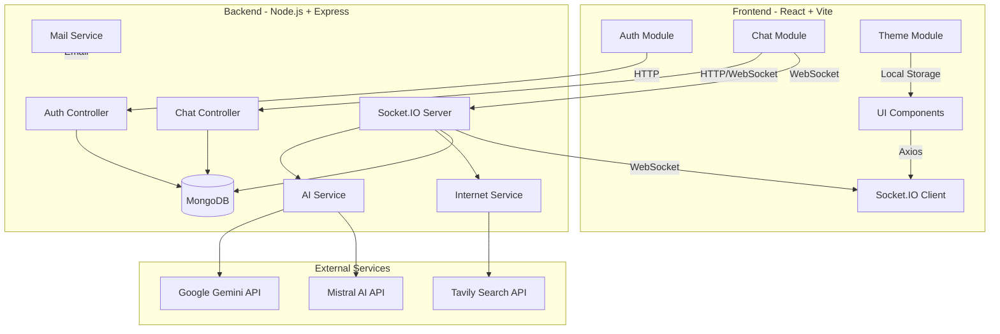
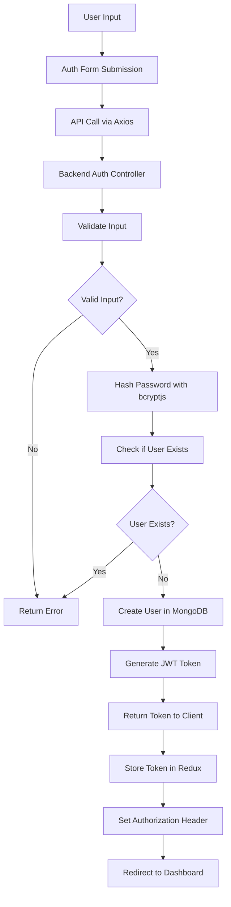
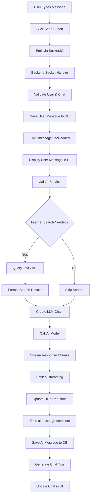

# Perplexity - AI-Powered Chat Application

A full-stack web application that provides an intelligent chat interface with real-time communication, internet search capabilities, and multi-model AI support.

## Project Overview

Perplexity is a modern chat application that combines:
- Real-time messaging using WebSocket technology
- Integration with multiple AI models (Google Gemini, Mistral AI)
- Internet search capabilities for context-aware responses
- User authentication and session management
- Chat history persistence
- Dark/Light theme support

## Technology Stack

### Backend
- **Runtime**: Node.js with ES Modules
- **Framework**: Express.js
- **Database**: MongoDB with Mongoose ODM
- **Real-time Communication**: Socket.IO
- **AI Integration**: LangChain with Google Generative AI and Mistral AI
- **Search Integration**: Tavily Search API
- **Authentication**: JWT (JSON Web Tokens)
- **Security**: bcryptjs for password hashing

### Frontend
- **Framework**: React 19
- **State Management**: Redux Toolkit
- **Styling**: Tailwind CSS
- **Build Tool**: Vite
- **Routing**: React Router DOM v7
- **HTTP Client**: Axios
- **Real-time Communication**: Socket.IO Client
- **Markdown Rendering**: React Markdown with GFM support
- **Syntax Highlighting**: Highlight.js
- **UI Icons**: Lucide React

## Project Architecture



## Features

### Authentication
- User registration and login
- JWT-based session management
- Secure password hashing with bcryptjs
- Protected routes and API endpoints

### Chat Functionality
- Real-time messaging with WebSocket
- Multi-turn conversations
- Chat history persistence
- Create, read, and delete chat threads
- Automatic chat title generation

### AI Integration
- Support for multiple AI models:
  - Google Gemini (via @langchain/google-genai)
  - Mistral AI (via @langchain/mistralai)
- Real-time streaming responses
- Context-aware conversations

### Internet Search
- Integration with Tavily Search API
- Retrieval augmented generation (RAG)
- Context-aware responses with web information

### User Experience
- Dark/Light theme switching
- Responsive design for mobile and desktop
- Markdown rendering with syntax highlighting
- Real-time message delivery

## Directory Structure

```
Perplexity/
├── Backend/
│   ├── src/
│   │   ├── app.js                 (Express app setup)
│   │   ├── config/
│   │   │   └── db.js              (MongoDB connection)
│   │   ├── controllers/
│   │   │   ├── auth.controller.js (Auth logic)
│   │   │   └── chat.controller.js (Chat logic)
│   │   ├── middleware/
│   │   │   ├── auth.middleware.js (JWT verification)
│   │   │   ├── errorHandler.middleware.js
│   │   │   └── validate.middleware.js
│   │   ├── models/
│   │   │   ├── user.model.js
│   │   │   ├── chat.model.js
│   │   │   └── message.model.js
│   │   ├── routes/
│   │   │   ├── auth.routes.js
│   │   │   └── chat.routes.js
│   │   ├── services/
│   │   │   ├── ai.service.js      (AI integration)
│   │   │   ├── internet.service.js (Search integration)
│   │   │   └── mail.service.js
│   │   ├── sockets/
│   │   │   └── server.socket.js   (WebSocket handlers)
│   │   └── validator/
│   │       └── auth.validator.js
│   ├── package.json
│   ├── server.js                  (Entry point)
│   └── plan.txt
│
├── Frontend/
│   ├── src/
│   │   ├── main.jsx               (App entry point)
│   │   ├── app/
│   │   │   ├── App.jsx
│   │   │   ├── App.routes.jsx     (Route definitions)
│   │   │   ├── app.store.js       (Redux store)
│   │   │   └── theme.slice.js
│   │   ├── features/
│   │   │   ├── Auth/
│   │   │   │   ├── auth.slice.js
│   │   │   │   ├── components/
│   │   │   │   ├── hooks/
│   │   │   │   ├── pages/
│   │   │   │   ├── services/
│   │   │   │   └── validator/
│   │   │   ├── Chat/
│   │   │   │   ├── chat.slice.js
│   │   │   │   ├── components/
│   │   │   │   ├── hooks/
│   │   │   │   ├── pages/
│   │   │   │   └── services/
│   │   │   ├── Theme/
│   │   │   └── API/
│   │   ├── hooks/
│   │   │   └── useIsMobile.jsx
│   │   └── utils/
│   └── package.json
│
└── README.md (this file)
```

## Data Flow Diagrams

### User Registration/Login Flow



### Chat Message Flow



## Getting Started

### Prerequisites
- Node.js (v16 or higher)
- MongoDB (local or Atlas)
- Environment variables configured

### Installation

#### Backend Setup
```bash
cd Backend
npm install
# Create .env file with required variables
npm run dev
```

#### Frontend Setup
```bash
cd Frontend
npm install
npm run dev
```

The application will be available at `http://localhost:5173` (frontend) with backend at `http://localhost:3000`.

## Environment Variables

### Backend (.env)
```
MONGODB_URI=your_mongodb_connection_string
JWT_SECRET=your_jwt_secret_key
GOOGLE_API_KEY=your_google_api_key
MISTRAL_API_KEY=your_mistral_api_key
TAVILY_API_KEY=your_tavily_api_key
SMTP_HOST=your_email_host
SMTP_PORT=your_email_port
SMTP_USER=your_email
SMTP_PASS=your_email_password
```

### Frontend (.env)
```
VITE_API_URL=http://localhost:3000
```

## API Documentation

### Authentication Endpoints
- `POST /api/auth/register` - Register new user
- `POST /api/auth/login` - Login user
- `GET /api/auth/me` - Get current user

### Chat Endpoints
- `GET /api/chat/chats` - Get all chats for user
- `GET /api/chat/:chatId/messages` - Get messages in a chat
- `DELETE /api/chat/:chatId` - Delete a chat

### WebSocket Events
- `message:send` - Send new message
- `message:user-added` - User message added
- `ai:streaming` - AI response streaming
- `ai:message-complete` - AI response complete

## Key Features Implementation

### Real-time Chat
Uses Socket.IO for bidirectional communication between client and server, enabling real-time message delivery and streaming AI responses.

### AI Integration
Leverages LangChain to abstract over multiple AI providers, allowing seamless switching between different AI models.

### Internet Search
Integrates Tavily Search API to enhance AI responses with current information from the web.

### State Management
Redux Toolkit manages application state including:
- Authentication state
- Chat history
- Active chat messages
- Theme preferences

## Development Workflow

1. **Backend Development**
   - Create new routes in `/routes`
   - Implement controllers in `/controllers`
   - Add business logic in `/services`
   - Use middleware for validation and authentication

2. **Frontend Development**
   - Create feature modules in `/features`
   - Use Redux slices for state management
   - Create reusable components
   - Implement custom hooks for logic

3. **Testing**
   - Test API endpoints with Postman/Thunder Client
   - Test UI components in browser
   - Verify WebSocket communication

## Performance Considerations

- Database indexing on frequently queried fields
- Pagination for chat history
- Real-time message streaming instead of full batch responses
- Client-side caching with Redux
- Responsive images and lazy loading

## Security Measures

- JWT-based authentication
- Password hashing with bcryptjs
- CORS whitelist configuration
- Input validation and sanitization
- Protected API endpoints with auth middleware
- Secure WebSocket connections

## Troubleshooting

### Backend won't start
- Check MongoDB connection string
- Verify all environment variables are set
- Check that port 3000 is not in use

### Frontend won't connect to backend
- Verify backend is running on port 3000
- Check VITE_API_URL environment variable
- Check browser console for CORS errors

### Chat not working
- Verify Socket.IO connection in browser DevTools
- Check backend socket handlers are registered
- Verify JWT token is valid

## Future Enhancements

- Multi-user chat rooms
- File upload support
- Voice-to-text integration
- Chat export functionality
- Advanced filtering and search
- User profiles with preferences
- Admin dashboard for monitoring

## License

ISC

## Support

For issues and questions, please check the Backend and Frontend README files for more detailed information about each component.
